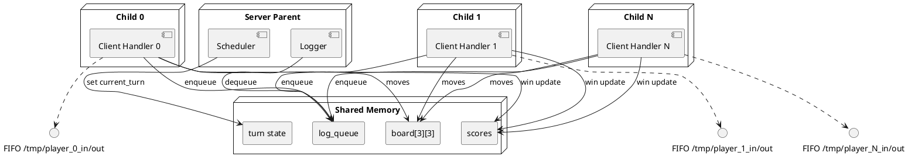

# Hybrid Concurrency Tic-Tac-Toe Server

## Game rules
* 3x3 Tic-Tac-Toe grid with 3–5 concurrent players. Symbols are assigned based on the player index (`'X' + id`).
* Players submit a move as `row col` (0-based). Invalid or occupied cells are rejected and the same player must retry.
* First player with three in a row (horizontal, vertical, or diagonal) wins the round. If all nine cells are filled without a winner the round is a draw.
* After each round the board resets automatically and a new game starts without restarting the server. Scores persist across rounds and across restarts via `scores.txt`.

## Deployment / IPC overview
The server runs on a single Linux host. Each client connects through a pair of named pipes created under `/tmp`:
* **server → client:** `/tmp/player_<id>_out`
* **client → server:** `/tmp/player_<id>_in`

The parent process forks one child per player. Each child owns a client pipe pair but shares all game data via POSIX shared memory. Synchronization uses process-shared pthread primitives. The following PlantUML diagram can be rendered to view the full topology:

## Hybrid architecture
* **Process model:** The parent configures shared memory and forks one child per player. Children exclusively handle client I/O through named pipes.
* **Thread model (parent only):**
  * **Logger thread:** Blocks on a process-shared condition variable and writes ordered log lines to `game.log`.
  * **Scheduler thread:** Implements round-robin selection of the next active player. It marks `current_turn`, wakes waiting children, and waits for a turn-completion condition.
* **Shared data:** All board cells, turn flags, active-player bitmap, persistent scores, log queue, and synchronization primitives live in the shared memory segment `SHM_NAME`.

## Shared memory layout
The `shared_state_t` layout co-locates all process-coordinated data:
* `board[3][3]`, `moves_made`, `game_active` – current round state.
* `current_turn`, `turn_in_progress` – scheduler/turn coordination.
* `active_players[]`, `player_count` – runtime roster.
* `log_queue` – bounded circular buffer with process-shared mutex + condvar.
* `scores` – array of `player_score_t` guarded by a process-shared mutex.
* `state_mutex`, `turn_cv`, `turn_done_cv` – process-shared primitives for turn orchestration.
* `shutdown` flag – used to notify threads and children to exit cooperatively.

## Synchronization strategy
* **Turn control:** Scheduler sets `turn_in_progress=1`, assigns `current_turn`, and broadcasts `turn_cv`. The active child wakes, validates/executes the move, then clears `turn_in_progress` and signals `turn_done_cv`. Scheduler waits on that condition before advancing.
* **Board updates:** Protected by `state_mutex`. Move validation and winner/draw checks occur inside the critical section to avoid races.
* **Logging:** `log_queue` uses a process-shared mutex + condition. Producers (children) enqueue and signal; the logger blocks on the condition to avoid busy waiting.
* **Scores:** Updates guarded by the process-shared score mutex. Winner increments are atomic; persistence writes use the same lock for consistency.
* **Shutdown:** SIGINT/SIGTERM sets `shutdown`, broadcasts all conditions, and triggers score persistence/cleanup.

## Logger design
* Bounded queue of 256 messages stored in shared memory.
* Producers in every process drop the oldest entry if the queue is full, ensuring non-blocking behavior.
* The parent’s logger thread waits on the queue condition, dequeues in FIFO order, and appends to `game.log`, guaranteeing ordering across processes.

## Scheduler design
* Round-robin over the `active_players` bitmap with a minimum of 3 and maximum of 5 players.
* If a player disconnects, the bitmap entry is cleared; the scheduler naturally skips inactive slots.
* When `game_active` is false (after win/draw), the scheduler resets the board and starts a new game without restarting the server.

## Persistence strategy
* Scores are loaded from `scores.txt` at startup into shared memory under the score mutex.
* Winners increment their score while holding the same mutex.
* On SIGINT/SIGTERM or normal shutdown, `save_scores()` writes the shared table back to `scores.txt`, ensuring consistent durability.

## Multi-game handling
* When a round ends, the winning child sets `game_active=0` inside the `state_mutex` critical section.
* Scheduler detects the inactive state, calls `reset_board_locked()`, and announces the new game in the log queue before selecting the next player.
* Board state, move counters, and turn flags are fully reinitialized; scores remain accumulated.

## Testing evidence
* Manual loopback run with three clients shows ordered logs and score increments. Sample log snippet:
  * `Scheduler: new game prepared`
  * `Scheduler: Player 0 turn`
  * `Player 0 placed X at (0,0)`
  * `Scheduler: Player 1 turn`
  * `Player 1 placed Y at (1,1)`
  * `Player 2 wins this round!`
* Client output shows turn prompts and board states delivered over FIFOs. Example client transcript:
  * `Connected as Player 0. Enter moves as 'row col' or 'quit' to exit.`
  * `Current board:`
  * ` X |   |  `
  * `-----------`
  * `   |   |  `
  * `-----------`
  * `   |   |  `
  * `Your turn Player 0 (X). Enter move as: row col`
* Score file updated after win: `Player0 1` `Player1 0` `Player2 0`.

## Team responsibilities
| Role | Responsibilities |
| --- | --- |
| Lead Architect | Game rules, IPC layout, shared memory schema |
| Systems Programmer | Server concurrency, scheduler, logger implementation |
| Client/UX | CLI prompts, client reader/writer threads, validation feedback |
| QA & Ops | Test plans, log review, shutdown/cleanup verification |
| Documentation | Report authoring, diagram maintenance |
